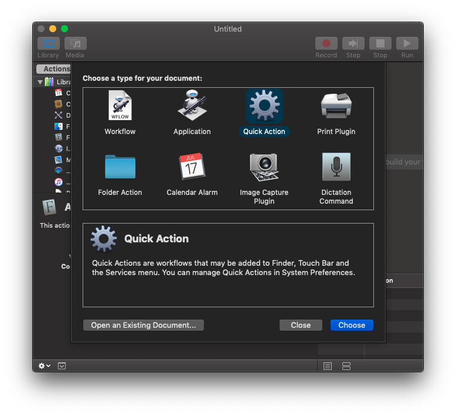

# search-on-youtube
Get the current track info from iTunes or [VOX](https://vox.rocks/) and search Youtube using Google Chrome. Use the scripts to create Quick Actions in Automator.app, then assign them shortcuts in System preferences.

```js
$ osascript -l JavaScript "/path/to/search-on-youtube/trackInfo.js" --search
```

Use `--search` param to search Youtube, leave it out to just display song info.


**Note**: If you plan to use the screenshot as a guide, make sure to change the shell in Automator's interface, because the default `/bin/bash` _just **doesn't** work_.


<details>
<summary>Other screenshots</summary>




</details>
